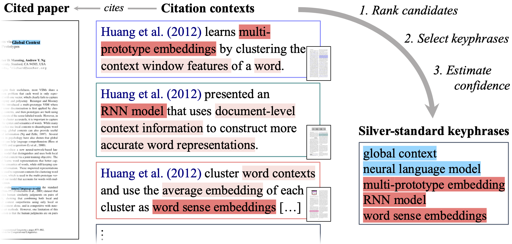

# 🧵 `silk`: Unsupervised Domain Adaptation for Keyphrase Generation using Citation Contexts

This repository contains the code for 🧵 `silk`, a method that relies on extracting silver-standard keyphrases from citation contexts to generate synthetic labeled data for domain adaptation.
We applied our method on distinct scientific domains —namely, Natural Language Processing, Astrophysics and Paleontology— thereby creating new adaptation data for each domain.
We also provide three human-labeled test sets to assess the performance of keyphrase generation models across these domains.

The 🧵 `silk` dataset is available from https://huggingface.co/datasets/taln-ls2n/silk



## Citation

If you use the `silk` dataset or this code, please cite the following items:

```
@misc{boudin2024unsuperviseddomainadaptationkeyphrase,
      title={Unsupervised Domain Adaptation for Keyphrase Generation using Citation Contexts}, 
      author={Florian Boudin and Akiko Aizawa},
      year={2024},
      eprint={2409.13266},
      archivePrefix={arXiv},
      primaryClass={cs.CL},
      url={https://arxiv.org/abs/2409.13266}, 
}
```